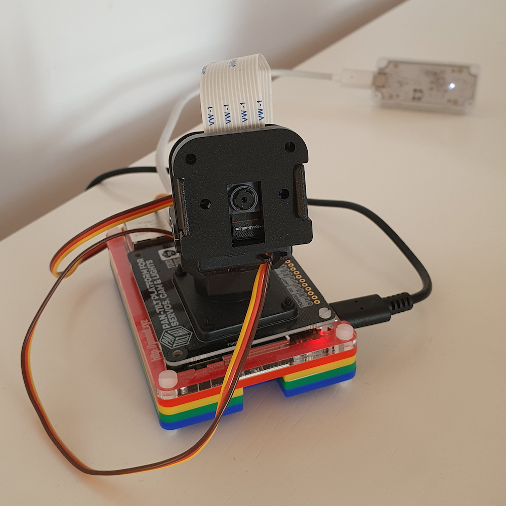

# Raspi-headtrack
Using a raspberry pi, Coral TPU, pan-tilt hat, I wrote a simple code for head tracking.

The main idea was to use two servos to control the angle (pan and tilt) of the camera, given the position of a face on the captured image. For the face detection I used a CoralTPU, which is a USB accelerator able to run tensorflow models even with low powered devices (let's say to be able to run AI on IOT or AIOT). I'm using an out of the box face detection model. The device's libraries gives you the bounding box of the face, so the rest is to update the angle of both servos to move towards the detected face.



Requirements: 
- Coral TPU (and modules installed) <https://coral.ai/products/accelerator>
- Pan-tilt hat (and modules installed) <https://shop.pimoroni.com/products/pan-tilt-hat?variant=33704345034>
- Raspberry picam
- Python 3.6+
- PIL

Code here: <https://github.com/carlosbravoa/raspi-headtrack>

Run it with:

```
python3 head_tracking_pantilt.py --model models/mobilenet_ssd_v2_face_quant_postprocess_edgetpu.tflite
```

